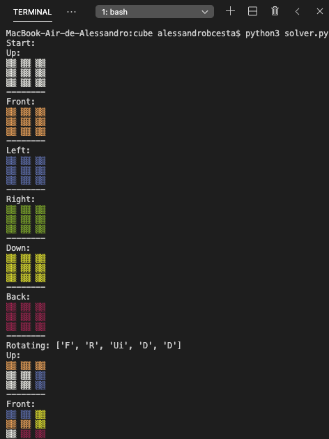
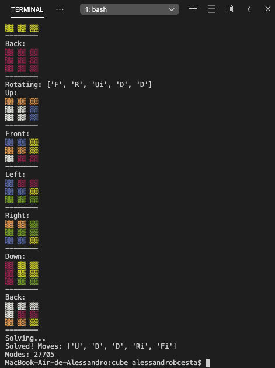

# :video_game: rubikSolver
A python script to solve a Rubik's Cube!

<p align="center">
  
  
<p>
  
  
## :clipboard: Intro
Shuffle a new Rubik's Cube, and watch the program try to fix it! By performing a Breadth First Search in the node tree of states, the returned answer will be for sure the shortest one!


## :hammer_and_wrench: Requirements

  - [Python 3.x](https://www.python.org/downloads/)
  - colored
  - copy


## :arrow_forward: How to run it

1. Clone this repository:

```sh
  $ git clone https://github.com/Alessandro1918/rubikSolver.git
```

2. Install the required libs:
```sh
  $ cd rubikSolver
  $ pip3 install -r requirements.txt
```

3. Run:

```sh
  $ python3 solver.py
```
